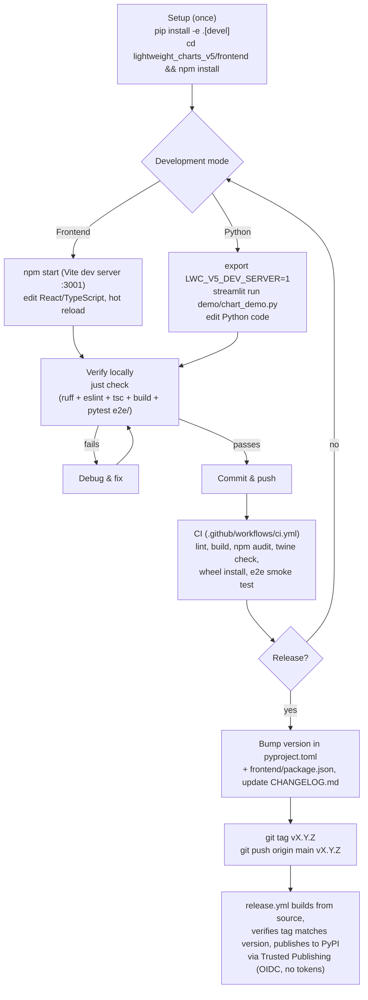

# Development & Deployment Notes

Notes on the development loop for this project.

- Keep two shells available in VSCode:
  - a Python Debug Console for the Streamlit test project
  - zsh for running the Vite dev server and re-building TypeScript
- A `justfile` at the repo root wraps all common tasks (`brew install just`;
  run `just` to list recipes). `just check` = lint + typecheck + build +
  e2e test, i.e. everything CI runs.

## Workflow overview



## TypeScript development iteration (zsh)

```bash
cd lightweight_charts_v5/frontend
npm start                # Vite dev server on http://127.0.0.1:3001 (hot reload)
npm run lint             # ESLint (flat config, eslint.config.mjs)
npm run typecheck        # tsc --noEmit
npm run build            # production build into frontend/build/
```

## Python linting

```bash
ruff check lightweight_charts_v5 demo e2e    # config in pyproject.toml [tool.ruff]
ruff check --fix lightweight_charts_v5 demo e2e   # auto-fix
```

## Python-side Streamlit demo (e.g. chart_demo.py)

```bash
pip install -e .                 # once
export LWC_V5_DEV_SERVER=1       # REQUIRED to load from the dev server;
                                 # without it the component uses frontend/build/
streamlit run demo/chart_demo.py # or via the VSCode debugger, Cmd-Shift-D
```

`LWC_V5_DEV_SERVER` also accepts a full URL (e.g. `http://127.0.0.1:3001`).

## Testing

```bash
pytest e2e/    # Playwright smoke test: renders a deterministic multi-pane
               # chart against frontend/build/ and asserts the chart
               # canvases appear
```

- Requires: `pip install -e .[devel] && playwright install chromium`
- CI (`.github/workflows/ci.yml`) runs on every push/PR:
  frontend eslint + typecheck + build + npm audit gate, then ruff,
  package build, twine check, wheel install, and the e2e smoke test.

## New release (preferred: GitHub Actions + PyPI Trusted Publishing)

1. Bump version in `pyproject.toml` (single source of truth; `__version__` is
   read from package metadata) and, cosmetically, `frontend/package.json`
2. Add a `CHANGELOG.md` entry (move items from the Unreleased section)
3. Commit, then tag and push:

   ```bash
   git tag vX.X.X && git push origin main vX.X.X
   ```

4. `.github/workflows/release.yml` builds the frontend and package from
   source, verifies the tag matches `pyproject.toml`, and publishes to PyPI
   via Trusted Publishing (OIDC) — no tokens involved.

One-time setup (DONE for 0.2.0): the PyPI "trusted publisher" is configured
(repo `locupleto/streamlit-lightweight-charts-v5`, workflow `release.yml`,
environment `pypi`) and was used for the 0.2.0 release.

Note: `frontend/build/` is gitignored; CI builds it. A pip install straight
from a git clone therefore needs `npm run build` in the frontend first.

## Manual release (fallback)

```bash
# Build the frontend
cd lightweight_charts_v5/frontend && npm ci && npm run build && cd ../..

# Build the Python package
rm -rf dist/
python -m pip install --upgrade build twine
python -m build

# Optional: test on TestPyPI first
twine upload --repository testpypi dist/*
pip install --index-url https://test.pypi.org/simple/ \
    --extra-index-url https://pypi.org/simple \
    streamlit-lightweight-charts-v5==X.X.X

# Production PyPI
twine upload dist/*
# Tokens: ~/.pypirc / Documents/Licenses/PyPI-Token.txt
```
